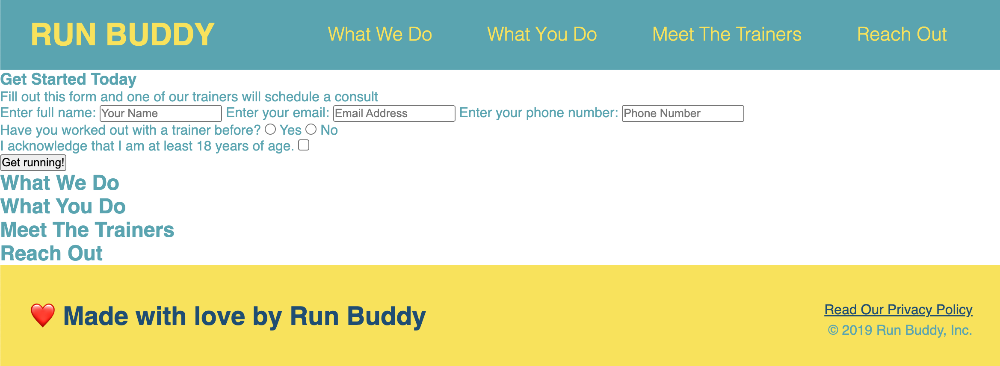

# Run Buddy

https://cbarber1984.github.io/run-buddy/

## This project is currently in progress
 

## Why I Chose This Project

## What I Learned
    - Visually sketching out the front-end elements of a project prior to writing code makes the writing process more efficient.
    - Use of `<a>` elements to implement site navigation elements
    - The difference between box-sizing: border-box and box-sizing: content-box
    - How to connect form and label HTML elements

## Next Steps
    - Set the form submit button to actually submit data to a trackable location
    - Add map to the reach out section
    - Add images to the meet the trainers section
    - Add CSS styles to the rest of the site

