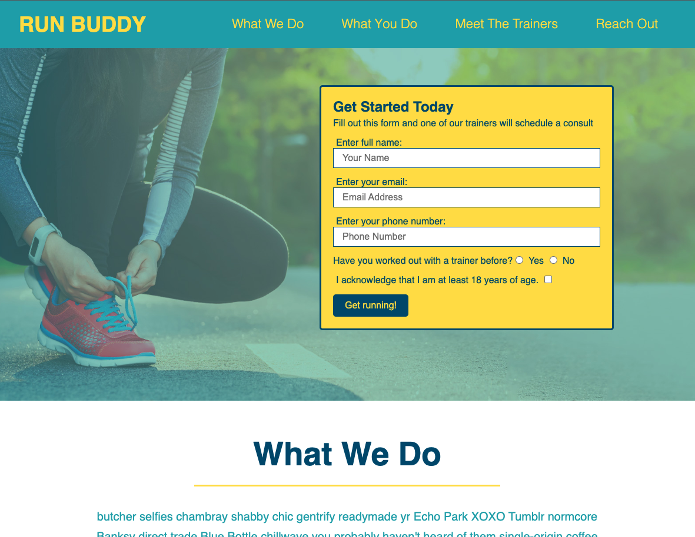

# Run Buddy

https://cbarber1984.github.io/run-buddy/

 

## Why I Chose This Project
I wanted an experience designing a client website to perform specific functions and follow a design 
scheme inherited from a design team.

## What I Learned
    - Visually sketching out the front-end elements of a project prior to writing code makes the 
      writing process more efficient.
    - Use of `<a>` elements to implement site navigation elements
    - The difference between box-sizing: border-box and box-sizing: content-box
    - How to connect form and label HTML elements
    - The practical application of using generic classes and CSS rules to efficiently style 
      multiple elements
    - How to use iframe to embed Google Maps
    - Practically implementing secondary style sheets to efficiently manage secondary pages

## Next Steps
    If I were going to continue developing this site, here are the things I would like to do:
    - Set the form submit button to actually submit data to a trackable location
    - Implement media queries to make the site elements more responsive for mobile users

